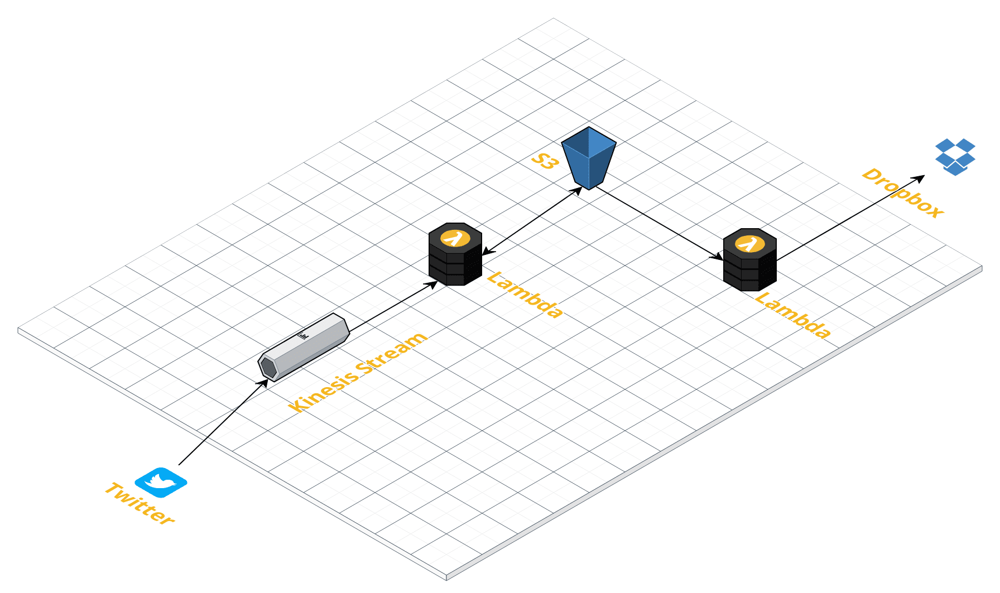
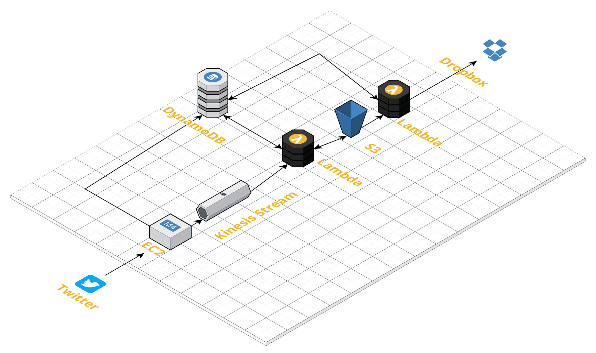

# :heart: Likesaver 
Likesaver is a service that automatically downloads pictures from a Twitter user's "like" activity to a designated Dropbox folder. 

## Demo
(insert link to demo video)

## Inspiration
I often use [Twitter](https://twitter.com/ "Twitter's Homepage") and the [Pocket app](https://getpocket.com/ "Pocket's Homepage") as a way to archive interesting articles and blog posts so I figured it would be fun to try and create a variant of Pocket for picture archiving (memes). Basically, I find myself screenshotting memes from Twitter way too often and I wanted a way to automate this.

## AWS Services Used
- Kinesis
- Lambda
- S3

Although I didn't get to it yet, I plan on including API Gateway, EC2, and DynamoDB in order to turn the service into a scalable webapp for anyone to interact with.

## Architecture + How I built it

### Twitter
I used [Tweepy](http://docs.tweepy.org/en/v3.5.0/getting_started.html), a wrapper for the Twitter API, in order to authenticate a user's Twitter and listen for likes from the user's own activity.

### Kinesis
In order to make the service scalable, I used a Kinesis stream to capture data. Kinesis streams can collect and analyze large amounts of data in real time, therefore are convenient when dealing with Twitter. Additionally, AWS lets you create multiple Kinesis instances and have them run across a set of auto-scaling EC2 instances. 

### Lambda and S3
I set up an AWS lambda function to listen for Kinesis records (a user's activity) and capture image URLs from likes. One function downloads the image to an S3 bucket and another function uploads it to a Dropbox folder.

## Challenges I ran into
Initially, I wanted to use Google Photos in place of Dropbox since most people tend to use it to store images, however I ran into a lot of trouble using the Google Picasa API and decided to use Dropbox's(the setup process is pretty quick). 

Due to time constraints, I wasn't able to integrate DynamoDB and EC2. Right now, I use a config file where I upload my own Twitter and Dropbox auth credentials. In order to turn Likesaver into a scalable webapp, I would need to create and host a website on EC2 so that users can log in by authenticating their Twitter and Dropbox accounts. This would require the creation of a DynamoDB table to store user credentials. 

## What I learned
My goal was to learn to integrate different AWS services and mimic functionality similar to the Pocket app. I learned to create AWS IAM roles and permissions since I had to connect lambda functions to Kinesis and S3. This was a bit tricky to figure out because you only want to allow permissions and policies that are absolutely necessary. I also became pretty famliar with CloudTrail logs while I debugged my lambda functions.
Finally, I learned a lot about the importance of incremental development and good API documentation. 

## What's next?
Now that I have tested the basic functionality, my next steps are to create a website and integrate Dynamo and EC2. 

The Dynamo schema would include:
- A users table with "twitter_handle" as the primary key
- 2 attributtes - the user's twitter auth and dropbox auth tokens

Additionally, in order to make this site scalable I would need to create an EC2 auto-scaling group and integrate API Gateway to manage calls to the Twitter API.

## How to get it working on your own

You will need to generate auth tokens for your Twitter and Dropbox accounts and put these on a config file, create a kinesis stream, S3 bucket, and 2 lambda functions. One function needs a Kinesis trigger and write access to S3, the other needs an S3 trigger and read access (processing-kinesis-records.py and s3-get.py respectively). Then, run twitter-kinesis.py.

Config file:
~~~
#Twitter auth tokens
consumer_key = ""
consumer_secret = ""
access_token_key = ""
access_token_secret = ""
#Dropbox auth tokens
dbx_token = ""
~~~

Finally, for more information watch the [demo video](https://twitter.com/)

